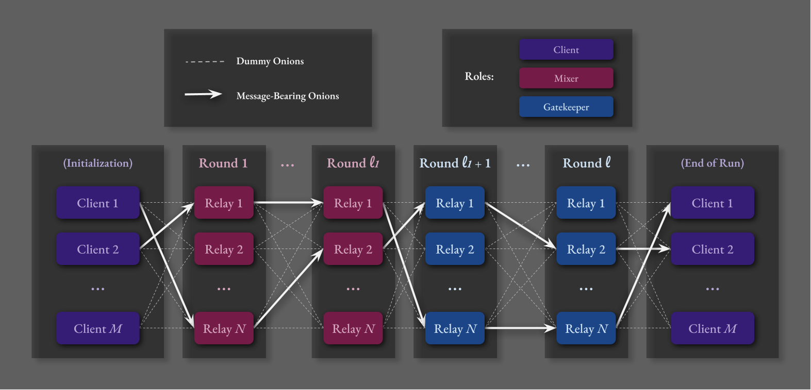
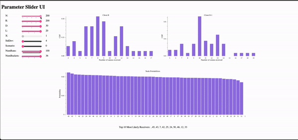
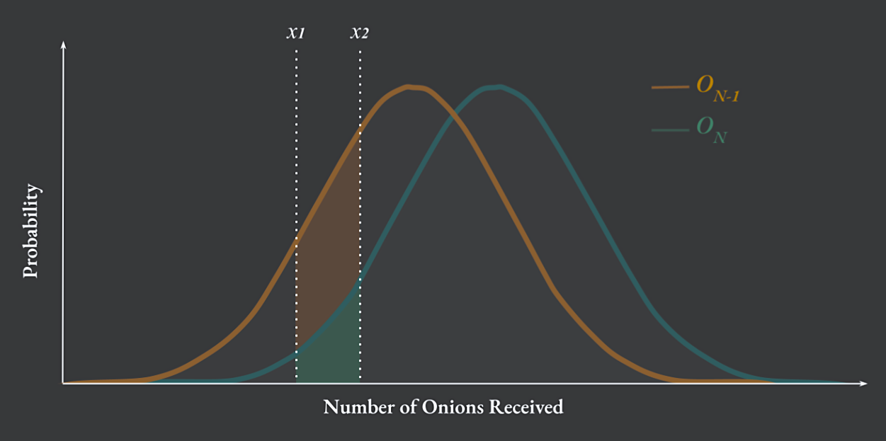

# Evaluating Privacy of the $\Pi_t$ Protocol :tulip:


## Introduction

This project aims to test the privacy guarantees of the $`\Pi_t`$ (_"t"_ for _"tulip"_ or _"threshold"_) protocol, which
was first described theoretically in [\[ALU24\]](#ALU24). The focus of this experiment is on modeling the adversary's ability
to infer the location of message-bearing onions.  

For an implementation of $`\Pi_t`$, see [github.com/HannahMarsh/pi_t-experiment](https://github.com/HannahMarsh/pi_t-experiment)

&nbsp;


<figure>
  <figcaption><b>Figure 1</b> - <em>Routing Path Visualization, Example "Scenario 0" (with N clients, R Relays, l1 mixers, and l rounds)</em></figcaption>
  
</figure>

## See the live demo
[https://b9cb-76-119-56-207.ngrok-free.app/](https://b9cb-76-119-56-207.ngrok-free.app/)

## Background

[Differential privacy](#DMNS06) is a mathematical framework for ensuring that the results of data analysis do not reveal any specific individual's data.

In the context of $`\Pi_t`$ and other onion routing protocols, a more nuanced form of differential privacy, called [ _($`\epsilon`$, $`\delta`$)-Differential Privacy_ ](https://www.cis.upenn.edu/~aaroth/Papers/privacybook.pdf), ensures that an adversary observing network traffic cannot (with high confidence)
distinguish between two neighboring communication patterns. This means that the inclusion or exclusion of a single individual's data does not significantly affect the outcome of any analysis.

Epsilon (&epsilon;) and delta ($`\delta`$) are the parameters that define our _(&epsilon;, $`\delta`$)-differential privacy_ guarantees:
- **&epsilon;**: A non-negative parameter that bounds the multiplicative difference in probabilities of any outcome
  occurring whether an individual's data is included or not. Smaller values of &epsilon; indicate stronger privacy guarantees.
- **$\delta$**: A non-negative parameter that bounds the additive difference in probabilities, allowing for a small
  probability of error. Smaller values of $`\delta`$ also indicate stronger privacy guarantees.

Formally, a randomized algorithm or mechanism is _&epsilon;, $`\delta`$)-differentially private_ if for every pair of neighboring inputs
$`\sigma_0`$ and $`\sigma_1`$ and for every set $`\mathcal{V}`$ of adversarial views,

$$
\Pr[\text{View}^{\mathcal{A}}(\sigma_0) \in \mathcal{V}] \leq e^{\epsilon} \cdot \Pr[\text{View}^{\mathcal{A}}(\sigma_1) \in \mathcal{V}] + \delta
$$


## Parameters
- NumRuns: Number of trials
- $r$: Number of clients. 
- $n$: Number of relays
- $l$: Path length, i.e. number of rounds
- $\chi$: The fraction of corrupted nodes
- $x$: Server load (number of onions processed per node per round)
- &epsilon;: Determines bound ($e^{\epsilon}$) for multiplicative difference

## Experiment Setup



- Clients, $\[C_1...C_R\]$
  - We will choose target senders, $C_1$ and $C_2$
- Relays, $\[R_1...R_N\]$
- Adversary, $`\mathcal{A}`$
  - The adversary always drops onions from $C_1$
  - $`\mathcal{A}`$'s observables, $\text{View}(\sigma_i)$, for a scenario, $i$, include the number of onions sent and received by each client and node.
    - Let $O_{k,i}$ be the distribution (over many executions of scenario $i$) of the number of onions that client $C_k$ receives by the end of the run.

### Senarios

- We consider two neighboring scenarios for our experiment:
   - **Scenario 0 ($\sigma_0$)**:
      - $C_1$ sends a message to $C_R$
      - $C_2$ sends a message to $C_{R-1}$
   - **Scenario 1 ($\sigma_1$)**:
      - $C_1$ sends a message to $C_{R-1}$
      - $C_2$ sends a message to $C_R$

- In both scenarios, there are also dummy (checkpoint) onions to provide cover traffic.
- For example, in Scenario 1 where $C_2$ sends a message to $C_N$, the number of onions, $O_N$, received by $C_N$ will be shifted to the right by 1 compared to
  $O_{R-1}$ since $C_{R-1}$'s onion was dropped by $`\mathcal{A}`$.

### Adversary's Task

The adversary observes the network volume (number of onions each client and node are sending and receiving), along with routing information (who each node are sending to/receiving from each round). 
<s> Each round, the adversary updates the
probability distribution of where the message-bearing onion is likely located. The adversary's goal is to determine the most probable client $\[C_2...C_N\]$
that received a message-bearing onion from $C_1$. </s>

### Computing the Adversary's Advantage

- We aim to compute the ratio that the adversary is correct (i.e., the "advantage"). 
 - The "advantage" is essentially a measure of how well the adversary can use the observed data to make correct assumptions about which client sent the onion.
 - This is ideally bounded by $e^\epsilon$.



Installation
------------  

Clone the repository:

```bash  
git clone https://github.com/HannahMarsh/pi_t-privacy-evaluation.git;
cd pi_t-privacy-evaluation
```

Install dependencies:

```bash
bash go mod tidy
```

Build the project:

```bash
go build -v ./...
```  

Development
-----  

Run tests:

```bash
go test -v ./...
```

Usage
-----  

### Running the Data Collector for a range of parameter values (specified in `static/expectedValues.json)`

```bash  
go run cmd/main.go
```  

### Running the simulation for fixed paramater values (given as command argument flags)

```bash  
go run cmd/run/main.go -serverLoad 2 -n 100 -r 100 -l 10 -r 10 -X 1.0 -numRuns 1000 
```  

### Running the data visualization server

```bash  
go run cmd/ui/main.go -port 8200
```

---

### References

- <a name="ALU24"></a>[\[ALU24\]](https://ia.cr/2024/885) - Ando M, Lysyanskaya A, Upfal E. Bruisable Onions: Anonymous Communication in the 
Asynchronous Model. _Cryptology ePrint Archive_. 2024. ([Link to PDF](https://eprint.iacr.org/2024/885.pdf))
- <a name="DMNS06"></a>[\[DMNS06\]](https://people.csail.mit.edu/asmith/PS/sensitivity-tcc-final.pdf) -  Cynthia Dwork, Frank McSherry, Kobbi Nissim, and Adam Smith. Calibrating noise
  to sensitivity in private data analysis. In Shai Halevi and Tal Rabin, editors, _TCC 2006_, volume 3876 of _LNCS_, pages 265–284. Springer,
  Heidelberg, Germany, New York, NY, USA, March 4–7, 2006. ([Link to PDF](https://people.csail.mit.edu/asmith/PS/sensitivity-tcc-final.pdf))
- <a name="TGL-17"></a>[\[TGL+17\]](https://doi.org/10.1145/3132747.3132783) - Nirvan Tyagi, Yossi Gilad, Derek Leung, 
  Matei Zaharia, and Nickolai Zeldovich. Stadium: A distributed metadata-private messaging system. In Proceedings of the 26th
  Symposium on Operating Systems Principles, Shanghai, China, October 28-31, 2017, pages 423–440. ACM, 2017. ([Link to PDF](https://dl.acm.org/doi/pdf/10.1145/3132747.3132783))
- <a name="vdHLZZ15"></a>[\[vdHLZZ15\]](https://doi.org/10.1145/2815400.2815417) - Jelle van den Hooff, David Lazar, Matei Zaharia, and Nickolai Zeldovich. Vuvuzela: scalable private 
  messaging resistant to traffic analysis. In Ethan L. Miller and Steven Hand, editors, Proceedings of the 25th Symposium 
  on Operating Systems Principles, SOSP 2015, Monterey, CA, USA, October 4-7, 2015, pages 137–152. ACM, 2015. ([Link to PDF](https://dl.acm.org/doi/pdf/10.1145/2815400.2815417))

