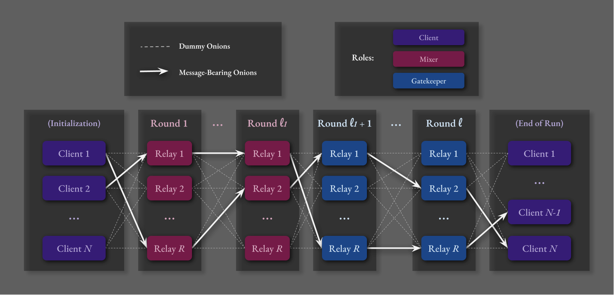

# Evaluating Privacy of the $\Pi_t$ Protocol :tulip:


## Introduction

This project aims to test the privacy guarantees of the $`\Pi_t`$ (_"t"_ for _"tulip"_ or _"threshold"_) protocol, which
was first described theoretically in [\[ALU24\]](#ALU24). The focus of this experiment is on modeling the adversary's ability
to infer the location of message-bearing onions.  

For an implementation of $`\Pi_t`$, see [github.com/HannahMarsh/pi_t-experiment](https://github.com/HannahMarsh/pi_t-experiment)

&nbsp;

<figure>
  <figcaption><em>Figure 1 - Onion Routing Visualization</em></figcaption>
  
</figure>

## Background

[Differential privacy](#DMNS06) is a mathematical framework for ensuring that the results of data analysis do not reveal any specific individual's data.

In the context of $`\Pi_t`$ and other onion routing protocols, a more nuanced form of differential privacy, called [ _($`\epsilon`$, $`\delta`$)-Differential Privacy_ ](https://www.cis.upenn.edu/~aaroth/Papers/privacybook.pdf), ensures that an adversary observing network traffic cannot (with high confidence)
distinguish between two neighboring communication patterns. This means that the inclusion or exclusion of a single individual's data does not significantly affect the outcome of any analysis.

Epsilon ($`\epsilon`$) and delta ($`\delta`$) are the parameters that define our _($`\epsilon`$, $`\delta`$)-differential privacy_ guarantees:
- **$\epsilon$**: A non-negative parameter that bounds the multiplicative difference in probabilities of any outcome
  occurring whether an individual's data is included or not. Smaller values of $`\epsilon`$ indicate stronger privacy guarantees.
- **$\delta$**: A non-negative parameter that bounds the additive difference in probabilities, allowing for a small
  probability of error. Smaller values of $`\delta`$ also indicate stronger privacy guarantees.

Formally, a randomized algorithm or mechanism is _($`\epsilon`$, $`\delta`$)-differentially private_ if for every pair of neighboring inputs
$`\sigma_0`$ and $`\sigma_1`$ and for every set $`\mathcal{V}`$ of adversarial views,

$$
\Pr[\text{View}^{\mathcal{A}}(\sigma_0) \in \mathcal{V}] \leq e^{\epsilon} \cdot \Pr[\text{View}^{\mathcal{A}}(\sigma_1) \in \mathcal{V}] + \delta
$$

## Experiment Setup

- Clients, $\[C_1...C_N\]$
  - We will choose target senders, $C_1$ and $C_2$
- Relays, $\[R_1...R_N\]$
- Adversary, $`\mathcal{A}`$
  - The adversary always drops onions from $C_1$
  - $`\mathcal{A}`$'s observables, $\text{View}(\sigma_i)$, for a scenario, $i$, include the number of onions sent and received by each client and node.
    - Let $O_{k,i}$ be the distribution (over many executions of scenario $i$) of the number of onions that client $C_k$ receives by the end of the run.

### Senarios

- We consider two neighboring scenarios for our experiment:
   - **Scenario 0 ($\sigma_0$)**:
      - $C_1$ sends a message to $C_N$
      - $C_2$ sends a message to $C_{N-1}$
   - **Scenario 1 ($\sigma_1$)**:
      - $C_1$ sends a message to $C_{N-1}$
      - $C_2$ sends a message to $C_N$

- In both scenarios, there are also dummy (checkpoint) onions to provide cover traffic.
- For example, in Scenario 1 where $C_2$ sends a message to $C_N$, the number of onions, $O_N$, received by $C_N$ will be shifted to the right by 1 compared to
  $O_{N-1}$ since $C_{N-1}$'s onion was dropped by $`\mathcal{A}`$.

### Adversary's Task

The adversary observes the network volume (number of onions each client and node are sending and receiving). Each round, the adversary updates the
probability distribution of where the message-bearing onion is likely located. The adversary's goal is to determine the most probable client $\[C_2...C_N\]$
that received a message-bearing onion from $C_1$.

### _Bad_ and _Good_ Events

- A "Bad event" is defined as when either $O_{N-1}$ or $O_{N}$ are "far away" from their expected values.
- Conversely, a "Good event" is when both are "close" to their expected values.

### Computing the Adversary's Advantage

- We aim to compute the ratio that the adversary is correct (i.e., the "advantage"). 
 - The "advantage" is essentially a measure of how well the adversary can use the observed data to make correct assumptions about which client sent the onion.
 - This is ideally bounded by $e^\epsilon$.


## $\Pi_t$ Implementation Overview

### Parameters
(_also defined in [/config/config.yml](config/config.yml)_)

- **$x$**: Server load (i.e. the expected number of onions each node processes per round).
- **$\ell_1$**: The number of mixers in each routing path.
- **$\ell_2$**: The number of gatekeepers in each routing path.
- **$L$**: The number of rounds (also the length of the routing path, equal to $`\ell_1 + \ell_2 + 1`$ ).
- **$N$**: The number of active nodes in the network at the start of the protocol.
- **$R$**: The number of clients registered with intent-to-send at the start the protocol.
- **$d$**: The number of non-null key-blocks in $S_1$. (thus $d$ is the threshold for number of bruises before an onion is discard by a gatekeeper).
- **$h$**: The heartbeat interval in seconds.
- **$\tau$**: ( $\tau \lt \(1 − \gamma\)\(1 − \chi\)$ ) The fraction of expected checkpoint onions needed for a node to progress its local clock.
- **$\epsilon$**: The privacy loss in the worst case scenario.
- **$\delta$**: The probability of differential privacy violation due to the adversary's actions.
- **$\lambda$**: The security parameter. We assume every quantity of the system, including $`N`$, $`R`$, $`L`$, and $`x`$, are polynomially bounded by $`\lambda`$.
- **$\gamma$**: Fraction of (indistinguishable) onions that A can drop.
- **$\theta$**: The maximum fraction of bruisable layers that can be bruised before the innermost tulip bulb becomes 
  unrecoverable. Note that $d = \theta \cdot \ell_1$
- **$\chi$**: The fraction of $N$ nodes that can be corrupted and controlled by the adversary (the subset is chosen prior to execution). Note that $\chi \lt \theta - 0.5$ and $\chi \lt \frac{d}{\ell_1} - 0.5$

### No Global Clock:

- Each node maintains a local clock ($c_j$) to track the progression of onion layers. A node does not progress   
  its local clock until it receives a sufficient number of checkpoint onions for the current layer (specified by $\tau$).

### Session Keys:

- Nodes publish part of a Diffie-Hellman exchange as part of their public keys.
  - See [internal/pi_t/keys/ecdh.go](internal/pi_t/tools/keys/ecdh.go) for this project's ECDH usage.
- Clients generate a random scalar $r$ for each onion to compute the shared secret with the server.
- The client's part of the exchange is included in the onion header.  

<div style="color: red;">TODO: update this:</div>

```markdown
- These shared keys are used (by the client during onion formation, and by a node when it processes the onion at layer $j$)   
  for each hop $j$ in the path with pseudorandom functions $F1(sk_{i,k}, j)$ and $F2(sk_{i,k}, j)$.
  - **$F1(sk_{i,k}, j)$**: If the result is 1, then a checkpoint onion is expected to be received by $P_i$   
    at hop $j$ and $y$ = $F2(sk_{i,k}, j)$ is used to calculate the expected nonce of that checkpoint onion.
    - See [internal/pi_t/prf/prf.go](/internal/pi_t/tools/prf/prf.go) for `PRF_F1` and `PRF_F2` implementations.
- **Checkpoints ($Y_k$)**: The set of expected nonces (calculated by _F2_) for the $k$-th layer checkpoint onions.
```

### Tulip Bulb Structure:

<table>
  <tr>
    <td>Header ($H_i$)</td>
    <td>Content ($C_i$)</td>
    <td>Stepel ($S_i$)</td>
  </tr>
  <tr>
   <td>
    <table>
     <tr>
      <td> $E_i$ </td>
      <td> $B_{i,1}$ </td>
      <td> $B_{i,2}$ </td>
      <td> ... </td>
      <td> $B_{i,l-1}$ </td>
     </tr>
    </table>
   </td>
   <td>
    <table>
     <tr>
      <td> $\{ . . . \{ \{ \{m\}_{k_{l}} \}_{k_{l-1}} \}_{k_{l-2}} . . . \}_{k_{1}}$ </td>
     </tr>
    </table>
   </td>
   <td>
    <table style="border: 0;">
     <tr>
      <td>
       $\langle K \rangle$-blocks:<br>
       <table>
        <tr>
         <td> $S_{i,1}$ </td>
         <td> $S_{i,2}$ </td>
         <td> ... </td>
         <td> $S_{i,d}$ </td>
        </tr>
       </table>
      </td>
       <td>
        $\langle 0 \rangle$-blocks:<br>
       <table>
        <tr>
         <td> $S_{i,d+1}$ </td>
         <td> $S_{i,d+2}$ </td>
         <td> ... </td>
         <td> $S_{i,l_{1}+1}$ </td>
        </tr>
       </table>
      </td>
     </tr>
    </table>
   </td>
  </tr>
</table>

<table>
 <tr>
  <td>Header ($H_i$)</td>
 </tr>
 <tr>
  <td>
   <table>
    <tr>
     <td>$E_i$</td>
     <td>$B_i$</td>
    </tr>
    <tr>
     <td>
      Enc( <br>
      &nbsp; $pk$ ( $P_i$ ), <br>
      &nbsp; $t_i$ ,  <br>
      &nbsp; ( Role, $i$ , $y_i$ , $\vec{A}_i$ , $k_i$ ) <br>
      )
     </td>
     <td>
      <table>
       <tr>
        <td>$B_{i,1} = $</td>
        <td>$B_{i,2} = $</td>
        <td>...</td>
        <td>$B_{i,l-1} = $</td>
       </tr>
       <tr>
        <td>
         <table>
          <tr>
           <td>
            Encrypted with $k_{i}$:
           </td>
          </tr>
          <tr>
           <td>
            <table>
             <tr> <td> $I_{i+1}$ </td> <td> $E_{i+1}$ </td> </tr>
            </table>
           </td>
          </tr>
         </table>
        </td>
        <td>
         <table>
          <tr>
           <td>Encrypted with $k_{i}$:</td>
          </tr>
          <tr>
           <td>
            <table>
             <tr>
              <td>
               Encrypted with $k_{i+1}$:
              </td>
             </tr>
             <tr>
              <td>
               <table>
                <tr> <td> $I_{i+2}$ </td> <td> $E_{i+2}$ </td> </tr>
               </table>
              </td>
             </tr>
            </table>
           </td>
          </tr>
         </table>
        </td>
        <td>...</td>
        <td>
         <table>
          <tr>
           <td>Encrypted with $k_{i}$:</td>
          </tr>
          <tr>
           <td>
            <table>
             <tr>
              <td>Encrypted with $k_{i+1}$:</td>
             </tr>
             <tr>
              <td>
               <table>
                <tr>
                 <td>...</td>
                </tr>
                <tr>
                 <td>
                  <table>
                   <tr>
                    <td>
                     Encrypted with $k_{i+l-2}$:
                    </td>
                   </tr>
                   <tr>
                    <td>
                     <table>
                      <tr> <td> $I_{i+l-1}$ </td> <td> $E_{i+l-1}$ </td> </tr>
                     </table>
                    </td>
                   </tr>
                  </table>
                 </td>
                </tr>
               </table>
              </td>
             </tr>
            </table>
           </td>
          </tr>
         </table>   
        </td>
       </tr>
      </table>
     </td>
    </tr>
   </table>
  </td>
 </tr>
</table>

#### Header ($H$):

- Consists of two parts: a [ ciphertext $`E_i`$ ](#Ei) and the [ rest of the header $`B_i`$ ](#Bi).
  - **$E_i$**: An encryption under the public key of the current processing party $P_i$ of the tuple <a name="Ei"></a>  
    $(i, y_i, k_i)$ where:
    - $i$&nbsp; is the position in the route.
    - $y_i$ is the metadata.
    - $k_i$ is the shared key for that layer. <a name="layer-key"></a>
  - **$B_i$**: The rest of the header, which includes: <a name="Bi"></a>
    - The nonce $y_i$.
    - The time window for the onion's arrival.
    - The next hop in the routing path.

#### Content ($C$):

- Contains the payload or the next layer of the onion.
- Encrypted under the [ layer key, $`k`$ ](#layer-key).
- For intermediate nodes, it contains the encrypted content of the next onion layer.
- For the final recipient, it contains the actual message.

#### Sepal ($S$):

- Protects the inner layers of the onion by absorbing bruises (caused by delays, tampering, or replay attacks) during transit.
- Consists of key-blocks and null-blocks.
- The key-blocks are encrypted versions of the bulb master key $K$.
- The null-blocks are encrypted versions of the value 0.
- As each mixer processes the onion, it peels a layer from the sepal:
  - If unbruised, the rightmost sepal block is dropped, retaining the same number of key blocks.
  - If bruised, the leftmost sepal block is dropped, reducing the number of key blocks.
  - This ensures that if the number of bruises exceeds a threshold $d$, the final gatekeeper cannot recover the master key $K$, making the onion
    undecryptable.

### 1. Node / Client Registration:

- Nodes publish their existence and public keys to the bulletin board.
  - See [internal/model/node/node.go](internal/model/node/node.go)
  - Nodes send periodic heartbeat messages so that the bulletin board can maintain a list of all active nodes in the network.
- Clients register their intent to send messages with the bulletin board.
  - See [internal/model/client/client.go](internal/model/client/client.go)
- When a sufficient number of nodes are active (given by $N$ ), and a sufficient number of clients have registered their 
  intent-to-send messages (given by $R$ ), the bulletin board broadcasts a start signal along with the following information.
  - Each participating client receives:
    - a list of active Mixers and Gatekeepers (along with their public keys and which checkpoint onions the client needs to create).
  - All participating nodes receive:
    - a list of expected nonces it should receive for each round _j_. 
  - See [internal/model/bulletin_board/bulletin_board.go](internal/model/bulletin_board/bulletin_board.go)

### 2. Initialization:

- When a client $k$ is notified of the start of a run, it receives from the bulletin board:
  - A list of participating Mixers and Gatekeepers where each relay node $P_i$ is associated with a public key $pk_i$ and a 
    list of sets P_$Y_1,...,Y_{l_1}$ , where $Y_j$ represents the subset of nonces $P_i$ expects to receive during round _j_ 
    which the client is responsible for sending.
- For each message to be sent, the client constructs a routing path by selecting a random subset of $l_1& [Mixers](#3-mixing-and-bruising)
  and $l_2$ [Gatekeepers](#5-gatekeeping) in the network.
  - routing_path[ $1...l_1$ ] are Mixers.
  - routing_path[ $l_1 + 1...l_1 + l_2$ ] are Gatekeepers.
  - routing_path[ $l_1 + l_2 + 1$ ] is the final destination.

<div style="color: red;">TODO: update this:</div>

```markdown
- The onion is constructed in layers, with the innermost layer containing the message encrypted with the recipient's public key.
  - Each subsequent layer $j$ contains encrypted metadata that includes:
    - A pseudorandom nonce that is unique to each onion (used to detect replay attacks).
    - The window of expected arrival time for the onion (used to detect delayed arrival).
    - The next hop in the routing path.
  - For each participant in the routing path, the client uses its corresponding session key and pseudorandom function F1   
    to determine if it should create a checkpoint onion for that layer. It then uses F2 to generate a nonce for each   
    checkpoint onion with its own random routing path.
    - The construction of checkpoint onions follows the same layer-by-layer encryption process as the regular onions.   
      The only difference is that checkpoint onions (a.k.a. dummy onions) don't carry a payload and instead provide cover for the "real"
      payload-carrying onions.
    - Each layer of the onion contains the encrypted shared key which is used by the next node in the path to decrypt the layer. This shared key is
      encrypted with the public key of the respective node and included in the header of each layer.
```
- All onions are sent to their first hop (a Mixer).

### 3. Mixing and Bruising:

<div style="color: red;">TODO: update this:</div>

```markdown
- When a Mixer receives an onion and decrypts its outer layer (header), it reveals the following data:
  - Multiple key slots that contain copies of the decryption key. If an onion is bruised, one of these key slots is invalidated.
  - The nonce (decrypted using the session key shared with the original sender).
  - The window of expected arrival time for the onion.
  - The next hop in the path (another Mixer or a Gatekeeper).
- The Mixer checks for delays or signs of tampering.
  - To detect a delay, the mixer compares the received "time" (see [local time](#no-global-clock)) with an expected time window. If an onion arrives
    outside this window, it is considered delayed.
  - To check for tampering, the mixer verifies the nonce against its expected set $Y_k$ (calculated with session key).
    - If the nonce is valid, the node removes the nonce from $Y_k$.
    - Otherwise, the onion is considered tampered with.
- If the onion is delayed or tampered with, the Mixer invalidates one of the key slots in the onion.
- The onion is then forwarded to the next node in the path.
- The number of protection layers is managed in a way that does not reveal any positional information. For instance,   
  additional dummy layers might be used to mask the actual number of active layers.
```

### 4. Intermediate Nodes:

- The onion continues to travel through the network of Mixers:
  - Each Mixer decrypts its layer, possibly adds bruises (invalidates key slots), and forwards the onion.
  - This process continues until the onion reaches a Gatekeeper.

### 5. Gatekeeping:

- The Gatekeeper receives the onion and checks the number of valid key slots.
- If the number of valid key slots is below a predefined threshold, the Gatekeeper discards the onion.
  - A threshold is determined based on the network's tolerance for delays and replay attacks
- If the onion is acceptable, the Gatekeeper forwards it to the next node (which can be another Mixer or a Gatekeeper, depending on the path).

### 6. Final Destination

- The recipient (client) always receives the onion from a Gatekeeper, never directly from a Mixer.
- The recipient receives the onion and decrypts it using their private key.
- The message is revealed, completing the communication process.

## Adversary Simulation Framework

### Potential Adversarial Functions:

- Observe all received onions and their metadata.
- Bruise or delay onions that pass through their layer (but cannot modify bruise count).
- Selectively drop onions to cause disruption, such as making onions appear delayed when they reach the next hop.
- Inject their own onions, replicate onions (replay attack) to create noise or mislead other nodes.

### Verifying Differential Privacy:

1. Create neighboring pairs of datasets that differ by one message or communication path.
2. Run the protocol on both neighboring datasets.
3. Record the adversary’s view for each dataset.
4. Measure how the distributions of the adversary’s views differ between the neighboring datasets.
5. Calculate the empirical probability of the adversary’s view for each dataset.
6. Verify that the privacy loss conforms to the differential privacy inequality (for &epsilon; and &delta;).

## Notes

### No Global Clock:

- In the $\Pi_t$ protocol, each node maintains a local clock ($c_j$) to track the progression of onion layers.
  - **Threshold (_&tau;_)**: A system parameter representing the fraction of checkpoint onions needed for the node to progress its local clock.
  - **Checkpoints ($Y_k$)**: A set of expected nonces for the k-th layer checkpoint onions.

1. **Receiving Onions**:

- A node $P_i$ (acting as a mixer) receives an onion $O$ and determines whether it was received "on time"   
  or not relative to $P_i$'s local clock.
- If the onion $O$ arrived late, $P_i$ bruises the onion and forwards the bruised onion _O'_ to the next destination.

2. **Processing Onions**:

- If $P_i$ is the last mixer on the routing path, it sends the peeled onion _O'_ to the first gatekeeper $G_1$.
- If $P_i$ is either early or on time, it places the peeled onion _O'_ in its message outbox.

3. **Checking Nonces**:

- If processing $O$ reveals a non-empty nonce $y$ &ne; &perp;, $P_i$ checks whether $y$ belongs to the set   
  $Y_k$ (the set of $k$-th layer checkpoint nonces P<sub>i</sub> expects to see from the onions it receives).
- If $y$ is expected, $P_i$ increments $c_k$ by one and updates $Y_k$ to exclude $y$.

4. **Advancing the Local Clock**:

- Upon processing a sufficient number of j-th layer onions (i.e., if $c_j$ &geq; &tau; |$Y_j$|),   
  $P_i$ sends out these onions (but not the onions for future hops) in random order and advances its local clock $c_j$ by one.
- Onions are batch-processed and sent out in random order at honest intermediaries when batch-processed.


Installation (for development)
------------  

Clone the repository:

```bash  
git clone https://github.com/HannahMarsh/pi_t-privacy-evaluation.git;
cd pi_t-privacy-evaluation
```

Install dependencies:

```bash
bash go mod tidy
```

Build the project:

```bash
go build -v ./...
```  

Development
-----  

Run tests:

```bash
go test -v ./...
```

Usage
-----  

All configurations are set in the [`config/config.yaml`](config/config/yaml) file.

### Running the Bulletin Board

```bash  
go run cmd/bulletin-board/main.go
```  

### Running a Node

```bash  
go run cmd/node/main.go -id=1
```  

### Running a Client

```bash  
go run cmd/client/main.go -id=1
```  

### Serving Metrics

```bash  
go run cmd/metrics/main.go -port 8200
```  

## Endpoints

### Bulletin Board

- **Register Client**: `POST /register`
- **Register Node**: `POST /register`
- **Get Active Nodes**: `GET /nodes`

### Node & Client

- **Receive Onion**: `POST /receive`
- **Get Status**: `GET /status`
- **Start Run**: `POST /start`

### Metrics

- **Messages**: `GET /messages`
- **Nodes**: `GET /nodes`
- **Clients**: `GET /clients`
- **Checkpoint Onion Counts**: `GET /checkpoints`
- **Visualize Onion Paths**: `GET /visualization`

When implementing the onion routing protocol, it helps to run the metric collector locally which provides visualization 
in real time of the messages and onions processes by each client and node. For a small number of clients/nodes, this makes 
debugging the protocol easier.

Obviously, it is not recommended to run the visualization program once we deploy the simulation in a distributed environment (with potentially hundreds of nodes and rounds). 


---

### References

- <a name="ALU24"></a>[\[ALU24\]](https://ia.cr/2024/885) - Ando M, Lysyanskaya A, Upfal E. Bruisable Onions: Anonymous Communication in the 
Asynchronous Model. _Cryptology ePrint Archive_. 2024. ([Link to PDF](https://eprint.iacr.org/2024/885.pdf))
- <a name="DMNS06"></a>[\[DMNS06\]](https://people.csail.mit.edu/asmith/PS/sensitivity-tcc-final.pdf) -  Cynthia Dwork, Frank McSherry, Kobbi Nissim, and Adam Smith. Calibrating noise
  to sensitivity in private data analysis. In Shai Halevi and Tal Rabin, editors, _TCC 2006_, volume 3876 of _LNCS_, pages 265–284. Springer,
  Heidelberg, Germany, New York, NY, USA, March 4–7, 2006. ([Link to PDF](https://people.csail.mit.edu/asmith/PS/sensitivity-tcc-final.pdf))
- <a name="TGL-17"></a>[\[TGL+17\]](https://doi.org/10.1145/3132747.3132783) - Nirvan Tyagi, Yossi Gilad, Derek Leung, 
  Matei Zaharia, and Nickolai Zeldovich. Stadium: A distributed metadata-private messaging system. In Proceedings of the 26th
  Symposium on Operating Systems Principles, Shanghai, China, October 28-31, 2017, pages 423–440. ACM, 2017. ([Link to PDF](https://dl.acm.org/doi/pdf/10.1145/3132747.3132783))
- <a name="vdHLZZ15"></a>[\[vdHLZZ15\]](https://doi.org/10.1145/2815400.2815417) - Jelle van den Hooff, David Lazar, Matei Zaharia, and Nickolai Zeldovich. Vuvuzela: scalable private 
  messaging resistant to traffic analysis. In Ethan L. Miller and Steven Hand, editors, Proceedings of the 25th Symposium 
  on Operating Systems Principles, SOSP 2015, Monterey, CA, USA, October 4-7, 2015, pages 137–152. ACM, 2015. ([Link to PDF](https://dl.acm.org/doi/pdf/10.1145/2815400.2815417))

